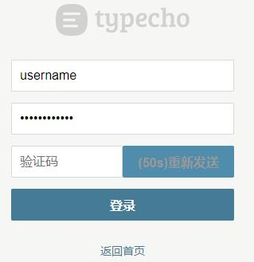
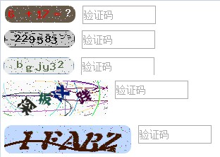

### typecho
typecho相关代码，【[我的博客](https://www.janbar.top/)】

### 登录页面获取验证码
1. 推送验证码使用了【[Server酱](http://sc.ftqq.com/?c=code)】,需要修改loginCode/var/Widget/Login.php的$sckey改为你自己的就行.
2. 使用方法就是将loginCode/var/Widget/Login.php替换var/Widget/Login.php,将loginCode/admin/login.php替换admin/login.php既可以,这些文件是基于【1.1-17.10.30-release.tar.gz】修改,可以用diff比较不同.
3. 看下效果图  

4. 倒计时60秒是js和php均有处理,可以有效避免暴力破解,同时验证码有效期只有120秒,这些参数可以通过修改源码自定义.在倒计时中页面刷新再次点获取验证码会继续上次倒计时.登录成功后点击退出再获取也会继续上次未完成的倒计时,该问题我不打算处理,因为正常登录操作不是很频繁,除非有人暴力破解.
5. 另外发送验证码可以自己改成发送邮件之类的,可以自行修改代码.
6. 本人不是很擅长php和前端,比如时间之类的没有做成可配置,不过很好理解,大家自行修改即可.还有就是没有做成插件是因为我不知道插件能不能搞定admin目录下的功能,因为admin目录和自定义主题不是一个位置,所以我就改了这两个文件做到了相关功能.

### 一个验证码插件
1. 在VariousCaptcha下是我以前写的一个验证码插件
2. 跳转到[typecho论坛帖子](http://forum.typecho.org/viewtopic.php?f=6&t=9825&p=37775&hilit=janbar#p37775)  

### 装了一个看板娘
1. 参考【[live2d-widget](https://github.com/stevenjoezhang/live2d-widget)】项目配置看板娘
2. 例子里面有右上角的GitHub跳转方式，爽的一逼
3. 例子里面有登录页面的看板娘，我也弄上去了，感觉整体还不错哟

